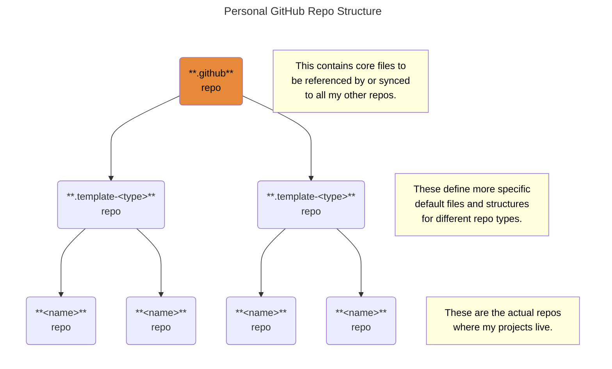

# `.github` Repository <!-- omit from toc -->

This is a special, base template repo that contains
default [community health files][health], [templates][templates],
[workflows][workflows], and any other files
to be shared with derived repositories.
For more information on how this special repo works,
see this article on [freeCodeCamp][freeCodeCamp].

<!-- Public URIs -->

[freeCodeCamp]: https://www.freecodecamp.org/news/how-to-use-the-dot-github-repository
[health]: https://docs.github.com/en/communities/setting-up-your-project-for-healthy-contributions/creating-a-default-community-health-file
[templates]: https://docs.github.com/en/communities/using-templates-to-encourage-useful-issues-and-pull-requests/configuring-issue-templates-for-your-repository
[workflows]: https://docs.github.com/en/actions/how-tos/writing-workflows
