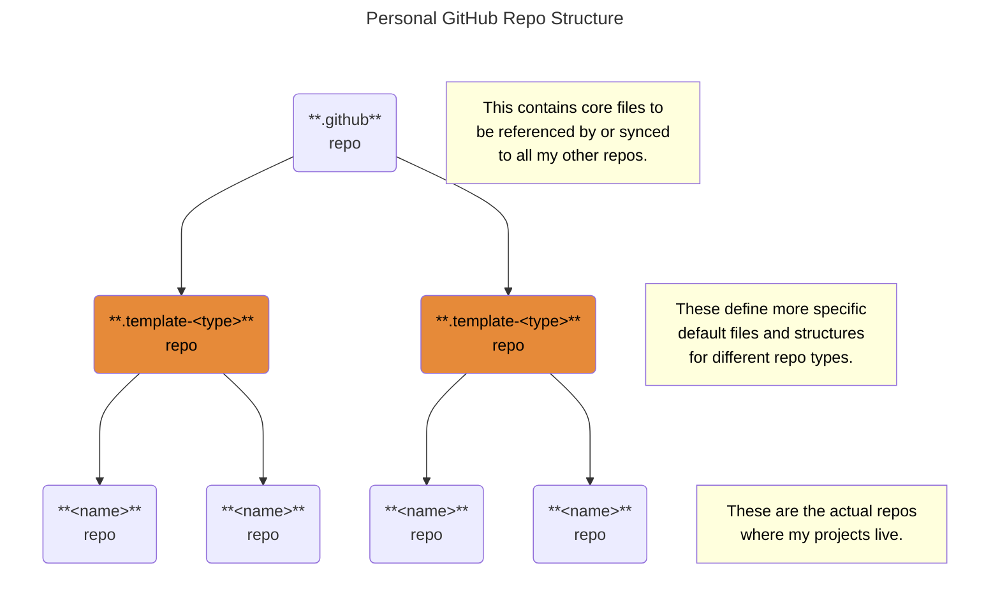

# NuGet Template Repository <!-- omit from toc -->

This is a template repo that contains the default configuration
for building and publishing a single NuGet package.

#### Table of Contents <!-- omit from toc -->

- [Description of Files in This Template Repo](#description-of-files-in-this-template-repo)
  - [Community Health Files](#community-health-files)
  - [GitHub Templates](#github-templates)
  - [GitHub Workflows](#github-workflows)
  - [Other Files](#other-files)

## Description of Files in This Template Repo

### [Community Health Files][health]

| File                         | Exists only in this repo | Synced to (and overridden in) derived repos | Notes      |
| :--------------------------- | :--------------------------: | :-------------------------------------------------: | :--------- |
| [`CODE_OF_CONDUCT.md`][coc]  |              ✅              |                                                     |            |
| [`CODEOWNERS`][codeOwners]   |                              |                         ✅                          |            |
| [`CONTRIBUTING.md`][contrib] |                              |                         ✅                          |            |
| [`FUNDING.yml`][funding]     |              ✅              |                                                     |            |
| `GOVERNANCE.md`              |                              |                                                     | Not needed |
| [`LICENSE`][license]         |                              |                         ✅                          |            |
| [`SECURITY.md`][security]    |                              |                         ✅                          |            |
| [`SUPPORT.md`][support]      |                              |                         ✅                          |            |

### [GitHub Templates][templates]

| Template                          | Exists only in this repo | Synced to (and overridden in) derived repos | Notes               |
| :-------------------------------- | :--------------------------: | :-------------------------------------------------: | :------------------ |
| Discussion category forms         |                              |                                                     | Not implemented yet |
| [Issue templates][issues]         |                              |                         ✅                          |                     |
| [Issue template chooser][chooser] |              ✅              |                                                     |                     |
| [Pull request template][prs]      |                              |                         ✅                          |                     |

### [GitHub Workflows][workflows]

| Workflow              | Exists only in this repo | Synced to (and overridden in) derived repos | Description                                                         |
| :-------------------- | :--------------------------: | :-------------------------------------------------: | :------------------------------------------------------------------ |
| [Template Sync][sync] |                              |                         ✅                          | Synchronizes changes from a template repo to a derived repo |

### Other Files

| File                                 | Exists only in this repo | Synced to (and overridden in) derived repos | Purpose                                     |
| :----------------------------------- | :--------------------------: | :-------------------------------------------------: | :------------------------------------------ |
| [`_Checklist.md`][checklist]         |                              |                         ✅                          | New repo checklist                          |
| [`.editorconfig`][editorConfig]      |                              |                         ✅                          | [Style guide rule definitions][styleGuides] |
| [`.gitmessage`][message]             |                              |                         ✅                          | [Commit message template][messageGuide]     |
| [`copilot-instructions.md`][copilot] |                              |                         ✅                          | [Copilot configuration][copilotDoc]         |
| [`dependabot.yml`][dependabot]       |                              |                         ✅                          | [Dependabot configuration][dependabotDoc]   |
| [`docs/`][docs]                      |                              |                         ✅                          | Contains documentation                      |
| [`settings.yml`][settings]           |                              |                         ✅                          | [Repo configuration][settingsDoc]           |

<!-- Source Code URIs -->

[checklist]: ./_Checklist.md
[chooser]: ./.github/ISSUE_TEMPLATE/config.yml
[coc]: ./CODE_OF_CONDUCT.md
[codeOwners]: ./.github/CODEOWNERS
[contrib]: ./CONTRIBUTING.md
[copilot]: ./.github/copilot-instructions.md
[dependabot]: ./.github/dependabot.yml
[docs]: ./docs/
[editorConfig]: ./.editorconfig
[funding]: ./.github/FUNDING.yml
[issues]: ./.github/ISSUE_TEMPLATE/
[license]: ./LICENSE
[message]: ./.gitmessage
[messageGuide]: ./docs/StyleGuides.md#commit-messages
[prs]: ./.github/pull_request_template.md
[security]: ./SECURITY.md
[settings]: ./.github/settings.yml
[styleGuides]: ./docs/StyleGuides.md
[support]: ./SUPPORT.md
[sync]: ./.github/workflows/template-sync.yml

<!-- Public URIs -->

[copilotDoc]: https://docs.github.com/en/copilot/customizing-copilot/adding-repository-custom-instructions-for-github-copilot
[dependabotDoc]: https://docs.github.com/en/code-security/dependabot/working-with-dependabot/dependabot-options-reference
[freeCodeCamp]: https://www.freecodecamp.org/news/how-to-use-the-dot-github-repository
[health]: https://docs.github.com/en/communities/setting-up-your-project-for-healthy-contributions/creating-a-default-community-health-file
[settingsDoc]: https://github.com/repository-settings/app
[templates]: https://docs.github.com/en/communities/using-templates-to-encourage-useful-issues-and-pull-requests/configuring-issue-templates-for-your-repository
[workflows]: https://docs.github.com/en/actions/how-tos/writing-workflows
