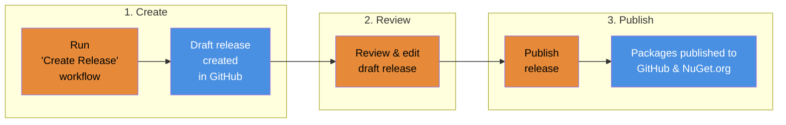

# Release Process <!-- omit from toc -->

This document describes how to create and publish releases.

#### Table of Contents <!-- omit from toc -->

- [Workflow](#workflow)
  - [1. Create Draft Release](#1-create-draft-release)
  - [2. Review and Edit](#2-review-and-edit)
  - [3. Publish](#3-publish)
- [Version Numbers](#version-numbers)

## Workflow

The process for creating and publishing a release
consists of 3 manual steps (in orange):

### 1. Create Draft Release

1. Go to `Actions` → `Create Release`
2. Click `Run workflow`
3. Ensure `main` is selected
4. Click `Run workflow`

A draft release will be created
with an auto-generated changelog and versioned packages attached.

### 2. Review and Edit

1. Go to `Releases`
2. Open the draft release
3. Verify:
   - ✅ Version number is correct
   - ✅ Changelog is accurate
   - ✅ Packages are attached
4. Edit as needed (optional)

### 3. Publish

1. Click `Publish release`

Packages will be automatically published to GitHub Packages and NuGet.org.

## Version Numbers

Version numbers follow [Semantic Versioning][semver]
and are calculated automatically by [GitVersion][gitVersion].

To force a specific version bump,
update `next-version` in [GitVersion.yml][gitVersionFile].

<!-- Source Code URIs (alphabetical by file hierarchy) -->

[gitVersionFile]: ../GitVersion.yml

<!-- Public URIs (alphabetical by name) -->

[gitVersion]: https://gitversion.net/docs
[semver]: https://semver.org
